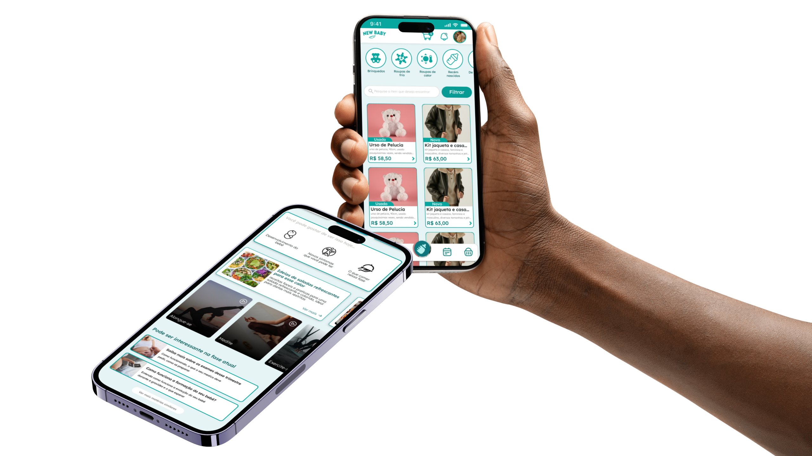

# **New Baby**

## Descubra o New Baby: o aplicativo que simplifica a rotina dos pais modernos!

O New Baby foi criado para tornar o dia a dia de mães e pais mais simples e organizado. Afinal, nada melhor do que acompanhar toda a rotina do seu filho de forma prática — e direto na palma da sua mão!

Acompanhe o desenvolvimento do seu filho desde a gestação até a adolescência. Tenha acesso a dicas personalizadas, agenda de compromissos, rede de apoio, contato com especialistas e muito mais — tudo em um só lugar.

## Tudo para apoiar você no dia a dia e impulsionar o desenvolvimento do seu filho — e da sua família como um todo.

### **Cuidar do seu filho começa com cuidar de você.**

O New Baby é uma plataforma pensada para acompanhar e fortalecer todas as fases da maternidade e paternidade. Ele oferece conteúdos personalizados, orientações práticas e recursos desenvolvidos por especialistas para apoiar não apenas o crescimento do seu filho, mas também o seu próprio bem-estar físico, emocional e mental.
Porque, antes de ser mãe ou pai, você é uma pessoa com sonhos, desafios e necessidades. E merece atenção, acolhimento e suporte genuíno ao longo dessa jornada transformadora que é construir uma família.

1. Contato com especialistas: conecte-se com profissionais qualificados para tirar dúvidas e receber orientações.
2. Conteúdo de qualidade: receba dicas confiáveis vindas de quem realmente entende do assunto — tudo pensado para facilitar seu dia a dia.
3. Vídeos, materiais e eBooks exclusivos: recursos que impulsionam o seu crescimento pessoal e fortalecem o desenvolvimento do seu filho.
4. Marketplace inteligente: compre itens essenciais e venda aquilo que sua família não utiliza mais — prático, seguro e com propósito.

## Chegou a hora de viver a maternidade/paternidade com leveza e apoio!
Baixe o New Baby e descubra um universo feito para você e sua família. 🌈👨‍👩‍👧‍👦

